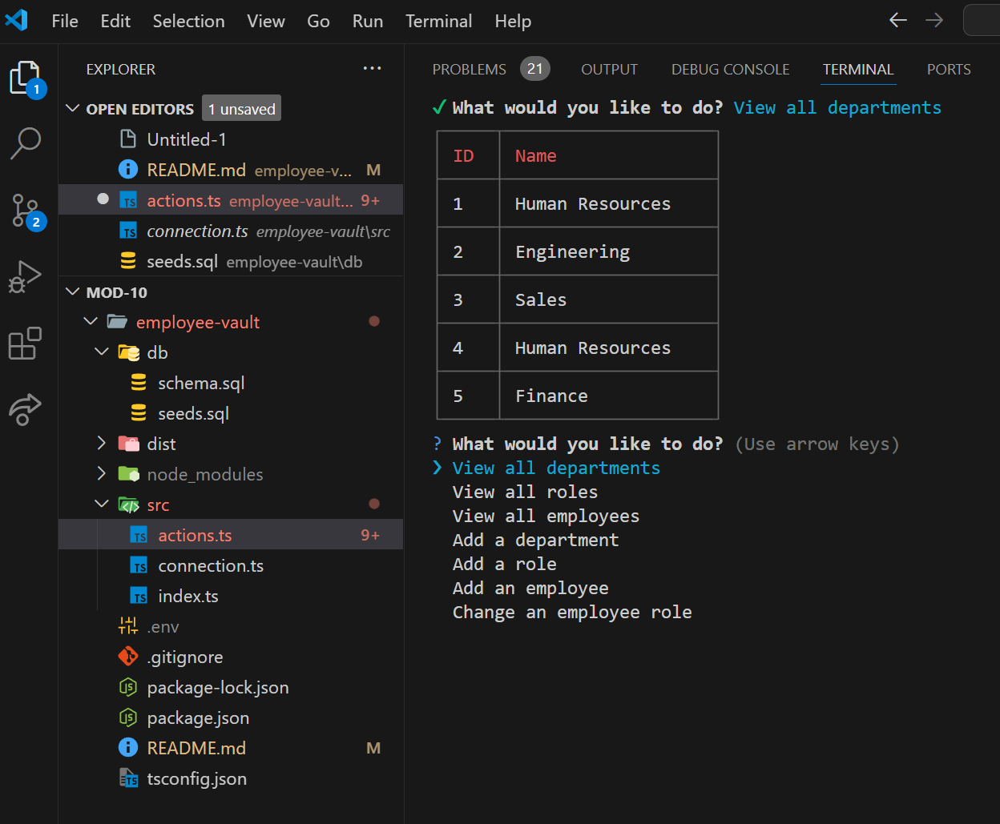

# Tutorial Video Link
https://drive.google.com/file/d/1wAj8w7xW6q3Hs-AujShwiXvH8NCSS9cb/view
# Employee-Vault
a simple way to keep information on your employees.
## How to use
first you will want to open your integrated terminal, 
second type npm run start, 
use the arrow keys to navigate the application. 
## Example image:

